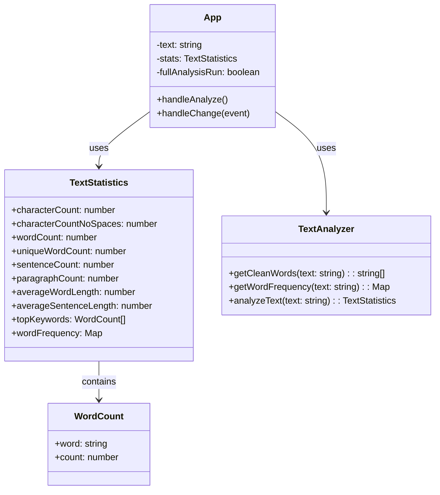

# Text Analyzer Pro

Una aplicación web para analizar textos y obtener estadísticas detalladas, desarrollada con React y TypeScript.

## Características

- Análisis en tiempo real de texto
- Conteo de caracteres (con y sin espacios)
- Conteo de palabras y palabras únicas
- Análisis de oraciones y párrafos
- Cálculo de longitudes medias
- Identificación de palabras clave más frecuentes
- Interfaz moderna y responsive

## Instalación

```bash
# Clonar el repositorio
git clone https://github.com/yourusername/textanalyzer.git

# Instalar dependencias
npm install

# Iniciar el servidor de desarrollo
npm run dev

# Ejecutar pruebas
npm test

# Construir para producción
npm run build
```

## Uso

1. Abre la aplicación en tu navegador
2. Pega o escribe el texto que deseas analizar en el área de texto
3. Las estadísticas básicas se actualizarán en tiempo real
4. Haz clic en "Analizar Texto Completo" para un análisis detallado
5. Revisa las estadísticas en el panel lateral

## Documentación Técnica

### Interfaces y Tipos

```typescript
/** Define la estructura para el conteo de palabras clave */
interface WordCount {
    word: string;    // La palabra analizada
    count: number;   // Número de ocurrencias
}

/** Define la estructura tipada de los resultados del análisis */
interface TextStatistics {
    characterCount: number;         // Total de caracteres (con espacios)
    characterCountNoSpaces: number; // Total de caracteres (sin espacios)
    wordCount: number;             // Total de palabras
    uniqueWordCount: number;       // Total de palabras únicas utilizadas
    sentenceCount: number;         // Total de oraciones
    paragraphCount: number;        // Total de párrafos
    averageWordLength: number;     // Longitud media de las palabras
    averageSentenceLength: number; // Número medio de palabras por oración
    topKeywords: WordCount[];      // Las 5 palabras más comunes
    wordFrequency: Map<string, number>; // Mapa con la frecuencia de cada palabra
}
```

### Funciones Principales

#### getCleanWords
```typescript
const getCleanWords = (text: string): string[]
```
Limpia y tokeniza el texto, convirtiéndolo a minúsculas y eliminando puntuación.
- **Entrada**: Texto a procesar
- **Salida**: Array de palabras limpias

#### getWordFrequency
```typescript
const getWordFrequency = (text: string): Map<string, number>
```
Calcula la frecuencia de cada palabra en el texto, excluyendo stop words.
- **Entrada**: Texto a analizar
- **Salida**: Mapa con la frecuencia de las palabras clave

#### analyzeText
```typescript
const analyzeText = (text: string): TextStatistics
```
Función principal que analiza un texto y devuelve todas las estadísticas.
- **Entrada**: Texto a analizar
- **Salida**: Objeto con todas las estadísticas calculadas

## Diagrama de Clases



## Pruebas

El proyecto incluye pruebas unitarias y de integración completas:

```bash
# Ejecutar todas las pruebas
npm test

# Ejecutar pruebas en modo observador
npm run test:watch

# Generar informe de cobertura
npm run test:coverage

# Ejecutar pruebas de mutación
npm run test:mutation
```

La cobertura actual del código es:
- Declaraciones: 100%
- Ramas: 90.9%
- Funciones: 100%
- Líneas: 100%

## Tecnologías Utilizadas

- React 19.2
- TypeScript 5.9
- Vite 7.1
- Jest + Testing Library
- ESLint
- CSS Modules
