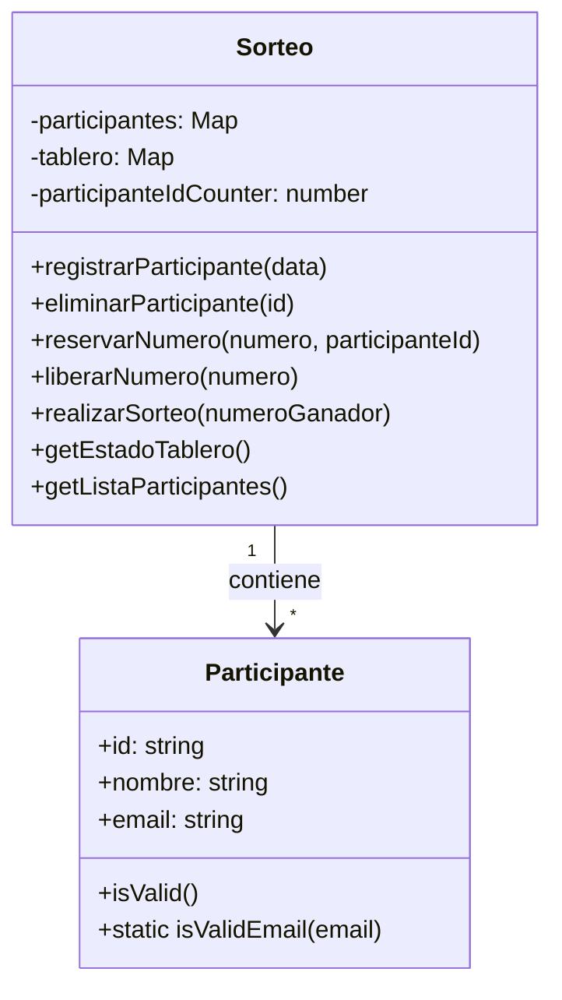

# Guía de Usuario - Sorteo Navideño

## 🎯 Descripción
Esta aplicación permite gestionar un sorteo navideño donde los participantes pueden seleccionar números y participar en un sorteo. 

## 📋 Instrucciones de Uso

### 1. Página de Inicio
- Al iniciar la aplicación, serás recibido en la página principal
- Aquí encontrarás dos opciones principales:
  - "Registrar Participante": Para añadir nuevos participantes
  - "Ver Tablero": Para gestionar números y realizar el sorteo

### 2. Registro de Participantes
1. Haz clic en "Registrar Participante"
2. Completa el formulario con:
   - Nombre del participante
   - DNI/NIE
   - Email
3. Pulsa "Registrar" para añadir al participante

### 3. Gestión del Tablero
1. En la página del tablero encontrarás:
   - Panel izquierdo: Estadísticas y controles
   - Panel derecho: Tablero de números

2. Para reservar números:
   - Selecciona un participante de la lista
   - Haz clic en los números que desees reservar
   - Los números reservados se mostrarán en color diferente

3. Para liberar números:
   - Haz clic en un número reservado
   - Confirma la liberación del número

### 4. Realizar el Sorteo
1. En el panel izquierdo del tablero:
   - Verifica que hay participantes registrados
   - Asegúrate de que hay números reservados
2. Haz clic en "Realizar Sorteo"
3. Selecciona el número ganador de la lista de números ocupados
4. Confirma la selección

### 5. Ver Resultado
- Después de realizar el sorteo, serás dirigido automáticamente a la página de resultados
- Aquí podrás ver:
  - El número ganador
  - El participante ganador
  - Detalles del sorteo

## 🔍 Características Adicionales
- Las estadísticas muestran en tiempo real:
  - Números disponibles
  - Números ocupados
  - Total de participantes
- Los datos se mantienen guardados incluso si cierras el navegador
- Puedes navegar entre páginas usando los botones de "Volver"

## ⚠️ Notas Importantes
- Cada participante debe estar registrado antes de poder reservar números
- Un número solo puede estar asignado a un participante a la vez
- Una vez realizado el sorteo, el resultado es definitivo
- Todos los datos se guardan automáticamente en el navegador

## 🔄 Navegación
- Usa el botón "Volver al Inicio" para regresar a la página principal
- Puedes acceder al registro de participantes desde cualquier página
- La página de resultados está disponible después de realizar el sorteo

---

# Documentación Técnica

## Diagrama de Clases


## Interfaces y Tipos Principales

### ParticipanteData
```typescript
interface ParticipanteData {
    id: string;      // Identificador único del participante
    nombre: string;  // Nombre del participante
    email: string;   // Email del participante
}
```

### NumeroStatus
```typescript
type NumeroStatus = {
    numero: string;           // Número en formato "00"-"99"
    ocupado: boolean;        // Indica si está reservado
    participanteId: string | null;  // ID del participante que lo reservó
    nombreParticipante: string | null;  // Nombre del participante
}
```

### SorteoStats
```typescript
interface SorteoStats {
    totalNumbers: number;        // Total de números disponibles (100)
    occupiedNumbers: number;     // Números reservados
    availableNumbers: number;    // Números libres
    percentageOccupied: number;  // Porcentaje de ocupación
    totalParticipants: number;   // Total de participantes
}
```

### SorteoResult
```typescript
interface SorteoResult {
    numeroGanador: string;              // Número ganador
    ganador: ParticipanteData | null;   // Datos del ganador
    mensaje: string;                     // Mensaje del resultado
}
```

## Arquitectura del Proyecto

El proyecto sigue una arquitectura modular organizada en las siguientes carpetas:

- `/src/core/`: Contiene la lógica principal del sorteo
  - `logicaSorteo.ts`: Implementación principal del sorteo
  - `types.ts`: Definiciones de tipos e interfaces
  - `sorteoService.ts`: Servicios y gestión de estado

- `/src/components/`: Componentes React de la interfaz
  - `/sorteo/`: Componentes específicos del sorteo
    - `tablero.tsx`: Visualización del tablero de números
    - `registroparticipantes.tsx`: Formulario de registro
    - `resultados.tsx`: Visualización de resultados

- `/src/UI/`: Componentes de interfaz reutilizables
  - `Boton.tsx`: Componente de botón personalizado
  - `StatCard.tsx`: Tarjeta de estadísticas

## Gestión de Estado

El estado del sorteo se gestiona mediante:
- Almacenamiento local (LocalStorage) para persistencia
- Estado en memoria usando Maps para rendimiento
- Actualizaciones automáticas al realizar cambios.